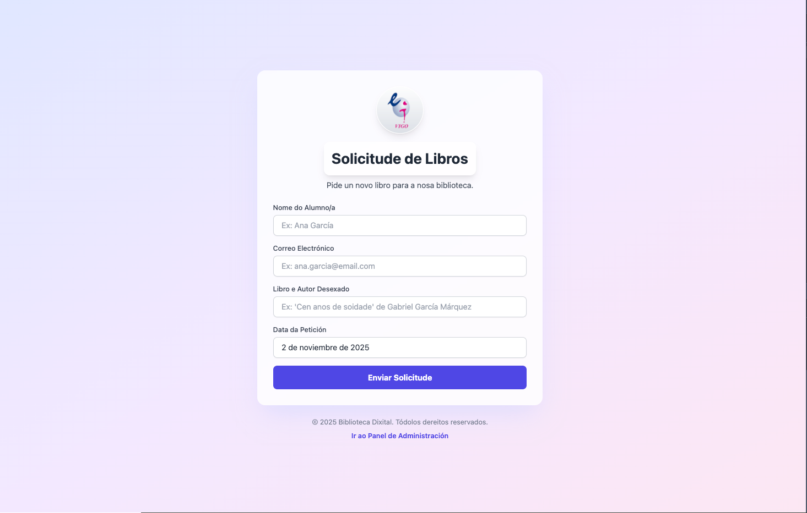

# 📚 Sistema de Solicitudes de Libros

Sistema completo de xestión de solicitudes de libros para bibliotecas, con frontend React + Vite e backend Django REST API desplegado en producción.



## 🌐 Demostración en Vivo

- **Frontend**: [https://formulario-libros-eoi.netlify.app](https://formulario-libros-eoi.netlify.app)
- **Backend API**: [https://biblioteca-backend-yisd.onrender.com/api/books/](https://biblioteca-backend-yisd.onrender.com/api/books/)
- **Admin Django**: [https://biblioteca-backend-yisd.onrender.com/admin/](https://biblioteca-backend-yisd.onrender.com/admin/)

## 📖 Sobre a Aplicación

Esta aplicación permite aos estudantes solicitar novos libros para a biblioteca da Escola Oficial de Idiomas (EOI). Os administradores poden xestionar as solicitudes, cambiar estados (Pendente, Aprobada, Rexeitada) e xerar certificados de confirmación en formato PDF.

### Funcionalidades Principais

**Para Estudantes:**
- Formulario intuitivo para solicitar libros
- Validación en tempo real dos campos
- Xeración automática de certificado de solicitude
- Acceso mediante código QR

**Para Administradores:**
- Panel de xestión de todas as solicitudes
- Cambio de estado das solicitudes
- Eliminación de solicitudes
- Xeración de código QR para compartir coa comunidade

## ✨ Características Técnicas

### Frontend (React + TypeScript + Vite)
- 📝 Formulario de solicitude con validación de datos
- 📜 Certificados de solicitude en formato PDF
- 👨‍💼 Panel de administración protexido por contraseña
- 📱 Código QR para acceso rápido
- 🎨 Interfaz moderna con Tailwind CSS
- ⚡ Optimizado con Vite para máxima velocidade
- 📱 Totalmente responsive (móbil, tablet, escritorio)

### Backend (Django + DRF + PostgreSQL)
- 🔌 API REST completa con operacións CRUD
- �️ Base de datos PostgreSQL en producción
- 🔐 Panel de administración Django
- ✅ Validacións robustas con serializers
- 🌐 CORS configurado para Netlify
- 📊 Sistema de estados para solicitudes
- � Desplegado en Render.com

## 🚀 Inicio Rápido

### Requisitos Previos

- **Node.js** 16+ e npm
- **Python** 3.8+
- **Git**

### 1️⃣ Clonar o Repositorio

```bash
git clone <repository-url>
cd formulario-de-solicitude-de-libros
```

### 2️⃣ Configurar Backend Django

```bash
# Ir ao directorio backend
cd backend

# Executar script de setup (recomendado)
./start.sh

# O bien manualmente:
cd config
python3 -m venv venv
source venv/bin/activate  # En Windows: venv\Scripts\activate
pip install -r ../requirements.txt
python manage.py makemigrations
python manage.py migrate
python manage.py createsuperuser  # Opcional
python manage.py runserver
```

O backend estará dispoñible en `http://localhost:8000`

### 3️⃣ Configurar Frontend React

En outra terminal:

```bash
# Volver ao directorio raíz
cd ..

# Instalar dependencias
npm install

# Copiar arquivo de configuración
cp .env.example .env.local

# Editar .env.local e configurar:
# VITE_API_URL=http://localhost:8000/api
# VITE_API_KEY=tu_clave_gemini_opcional

# Iniciar servidor de desarrollo
npm run dev
```

O frontend estará dispoñible en `http://localhost:5173`

## 📡 Endpoints da API

| Método | Endpoint | Descripción |
|--------|----------|-------------|
| GET | `/api/books/` | Listar todas as solicitudes |
| POST | `/api/books/` | Crear nova solicitude |
| GET | `/api/books/{id}/` | Obter solicitude específica |
| PATCH | `/api/books/{id}/` | Actualizar solicitude |
| DELETE | `/api/books/{id}/` | Eliminar solicitude |

### Exemplo de Solicitude

```json
POST http://localhost:8000/api/books/
Content-Type: application/json

{
  "name": "Ana García",
  "email": "ana@example.com",
  "book": "Cen anos de soidade - Gabriel García Márquez",
  "date": "2 de novembro de 2025",
  "status": "Pendente"
}
```

## 📁 Estrutura do Proyecto

```
formulario-de-solicitude-de-libros/
├── backend/                    # Backend Django
│   ├── config/
│   │   ├── config/            # Configuración Django
│   │   │   ├── settings.py
│   │   │   └── urls.py
│   │   ├── books/             # App de solicitudes
│   │   │   ├── models.py
│   │   │   ├── serializers.py
│   │   │   ├── views.py
│   │   │   └── urls.py
│   │   └── manage.py
│   ├── requirements.txt
│   ├── start.sh              # Script de inicio
│   └── README.md
├── components/               # Componentes React
│   ├── AdminView.tsx
│   ├── CertificateCard.tsx
│   ├── QRCodeModal.tsx
│   └── ...
├── services/                 # Servicios del frontend
│   ├── backendService.ts    # Comunicación con API Django
│   └── geminiService.ts     # Xeración de certificados
├── App.tsx                  # Componente principal
├── index.tsx               # Entry point
├── package.json
├── vite.config.ts
└── README.md
```

## 🔧 Configuración

### Variables de Entorno - Frontend (.env.local)

```env
# URL do backend API
VITE_API_URL=http://localhost:8000/api

# Contraseña do panel de administración
VITE_ADMIN_PASSWORD=biblioteca2024!
```

### Variables de Entorno - Backend (backend/.env)

```env
DJANGO_SECRET_KEY=your-secret-key
DJANGO_DEBUG=True
DJANGO_ALLOWED_HOSTS=localhost,127.0.0.1
```

## 🎯 Uso

### Como Alumno

1. Abre `http://localhost:5173`
2. Enche o formulario con:
   - Nome completo
   - Email
   - Libro e autor desexado
3. Envía a solicitude
4. Recibirás un certificado de confirmación

### Como Administrador

1. Pulsa "Ir ao Panel de Administración"
2. Ver todas as solicitudes
3. Cambiar o estado (Pendente → Aprobado → Mercado)
4. Eliminar solicitudes
5. Xerar código QR para compartir con alumnos

### Django Admin

1. Accede a `http://localhost:8000/admin/`
2. Usa os credenciais do superusuario
3. Xestiona solicitudes desde a interfaz admin

## 🛠️ Comandos Útiles

### Frontend

```bash
npm run dev          # Servidor de desarrollo
npm run build        # Build para producción
npm run preview      # Preview do build
```

### Backend

```bash
python manage.py runserver        # Iniciar servidor
python manage.py makemigrations   # Crear migracións
python manage.py migrate          # Aplicar migracións
python manage.py createsuperuser  # Crear admin
python manage.py shell            # Shell Django
```

## 🐛 Solución de Problemas

### Erro: "CORS policy"
- Verifica que o backend estea en execución en `http://localhost:8000`
- Comproba que `VITE_API_URL` en `.env.local` sexa correcta

### Erro: "Module not found"
```bash
# Frontend
npm install

# Backend
pip install -r backend/requirements.txt
```

### O código QR non se mostra
- Asegúrate de que instalaches `qrcode.react`: `npm install qrcode.react`
- Verifica que non haxa erros na consola do navegador

### Erro de migracións Django
```bash
cd backend/config
python manage.py migrate --run-syncdb
```

## � Despregue en Producción

### Frontend (Netlify)
- Build automático desde GitHub
- Variables de entorno configuradas
- CDN global para máxima velocidade
- HTTPS automático

### Backend (Render.com)
- PostgreSQL como base de datos
- Gunicorn como servidor WSGI
- WhiteNoise para servir arquivos estáticos
- Despregue automático desde GitHub
- Variables de entorno seguras

## �📚 Tecnologías Utilizadas

### Frontend
- React 19.2.0
- TypeScript 5
- Vite 6.4.1
- Tailwind CSS 3
- qrcode.react 3.1.0
- jsPDF para certificados

### Backend
- Django 4.2.23
- Django REST Framework 3.14+
- PostgreSQL (producción)
- django-cors-headers 4.0+
- gunicorn 23.0+
- whitenoise 6.6+
- dj-database-url 2.1+

## 🔐 Seguridade

✅ **Implementado en Producción:**
- `SECRET_KEY` único e seguro en variables de entorno
- `DEBUG=False` en producción
- PostgreSQL como base de datos en Render
- `ALLOWED_HOSTS` e `CORS_ALLOWED_ORIGINS` configurados
- HTTPS habilitado en Netlify e Render
- Validación e sanitización de todas as entradas
- Panel de administración protexido por contraseña

## 🤝 Contribución

As contribucións son benvidas! Por favor:
1. Fai fork do repositorio
2. Crea unha rama para a túa función
3. Fai commit dos cambios
4. Envía un pull request

## � Guía de Despregue

### Despregue do Backend en Render

1. Conecta o repositorio de GitHub
2. Crea un servizo Web con estas configuracións:
   - **Build Command**: `./build.sh`
   - **Start Command**: `cd backend/config && gunicorn config.wsgi:application`
3. Crea unha base de datos PostgreSQL en Render
4. Configura as variables de entorno:
   - `PYTHON_VERSION=3.11.9`
   - `DJANGO_SECRET_KEY=<clave-secreta>`
   - `DJANGO_DEBUG=False`
   - `FRONTEND_URL=https://formulario-libros-eoi.netlify.app`

### Despregue do Frontend en Netlify

1. Conecta o repositorio de GitHub
2. Configuración de build:
   - **Build Command**: `npm run build`
   - **Publish Directory**: `dist`
3. Configura as variables de entorno:
   - `VITE_API_URL=https://biblioteca-backend-yisd.onrender.com/api`
   - `VITE_ADMIN_PASSWORD=<contraseña-admin>`

Consulta os arquivos `DEPLOY.md` e `DEPLOY_QUICK.md` para máis detalles.

## �📄 Licenza

Este proxecto está baixo a licenza MIT.

## 📞 Contacto

Para preguntas ou soporte, por favor abre un issue no repositorio.

## 🙏 Agradecementos

Desenvolvido para a comunidade da **Escola Oficial de Idiomas (EOI)** para facilitar a xestión de solicitudes de novos libros na biblioteca.

---

Feito con ❤️ para a Biblioteca Dixital da EOI

**Estado**: ✅ En producción e funcionando
